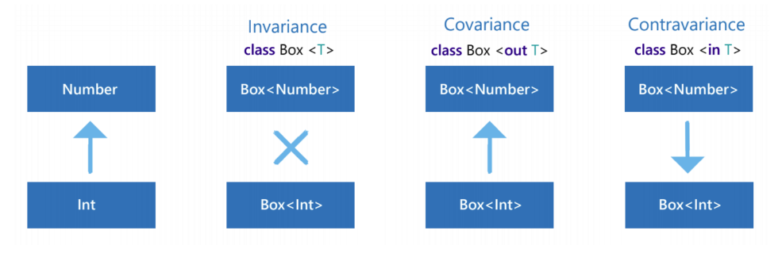

# Effective Kotlin - examples
***Disclaimer:*** This repository contains the personal notes and examples I gathered while reading the excellent book Effective Kotlin. It is by no means an extract or copy of the book. I encourage all Kotlin developers to buy and read this book.
## Part 1: Good Code
### Safety - Item 1 - 10
#### Item 1: limit mutability
* Mutation point
    * potential conflict - [MutableVarInCoroutine.kt](src/goodcode/safety/item1/MutableVarInCoroutine.kt)
* Read Only Property
    * can mutate - [ReadOnlyPropertiesCanMutate.kt](src/goodcode/safety/item1/ReadOnlyPropertiesCanMutate.kt)
    * final property - [FinalProperty.kt](src/goodcode/safety/item1/FinalProperty.kt)
    * copy in data classes - [CopyInDataClass](src/goodcode/safety/item1/CopyInDataClass.kt)
* Separation between mutable and read-only collections
    * never downcast immutable collection - [NeverDownCastImmutableCollection.kt](src/goodcode/safety/item1/NeverDownCastImmutableCollection.kt)
    * multiple mutation points - [MultipleMutationPoints.kt](src/goodcode/safety/item1/MultipleMutationPoints.kt)
* Do not leak mutation points
    * a defensive copy for standard objects
    * for collections upcast to readonly interfaces
#### Item 2: Minimize the scope of variables
* Use local variables instead of properties
* Use variables in the narrowest scope possible
    * Destructuring declarations can help - [DestructuringDeclarationHelpNarrowTheScope.kt](src/goodcode/safety/item2/DestructuringDeclarationHelpNarrowTheScope.kt)
    * Capturing - [PrimeNumbers.kt](src/goodcode/safety/item2/PrimeNumbers.kt)
        * Sieve of Eratosthenes
#### Item 3: Eliminate platform types as soon as possible
* Platform type - a type that comes from another language and has unknown nullability
* Platform vs. stated type - [PlatformVsStatedType.kt](src/goodcode/safety/item3/PlatformVsStatedType.kt)
#### Item 4: Do not expose inferred types
* inferred type exposition can be really dangerous - [DangerousInferredTypeExposion.kt](src/goodcode/safety/item4/DangerousInferredTypeExposion.kt)
#### Item 5: Specify your expectations on arguments and state
* require block - a universal way to specify expectations on arguments.
    * lazy message
    * smart cast - contract
* check block - a universal way to specify expectations on the state.
* assert block - a universal way to check if something is true. Such checks on the JVM will be evaluated only on the testing mode.
* Elvis operator with return or throw - popular for null check
    * [ElvisReturn.kt](src/goodcode/safety/item5/ElvisReturn.kt)
#### Item 6: Prefer standard errors to custom ones
* IllegalArgumentException and IllegalStateException - expectations on arguments and state
* IndexOutOfBoundsException
* ConcurrentModificationException
* UnsupportedOperationException
* UnsupportedOperationException
    * should be avoided - Interface Segregation Principle
        * no client should be forced to depend on methods it does not use
* NoSuchElementException
#### Item 7: Prefer null or Failure result when the lack of result is possible
* we should prefer returning null or Failure when an error is expected
    * Result as a sealed class - [ReturnFailure.kt](src/goodcode/safety/item7/ReturnFailure.kt)
        * Mistake in the book, page 68! [Item7Mistake](Item7Mistake.md)
    * getOrNull - as an example in stdlib - [GetOrNull.kt](src/goodcode/safety/item7/GetOrNull.kt)
* throwing an exception when an error is not expected
    * The way exceptions propagate is less readable for most programmers and might be easily missed in the code.
    * In Kotlin all exceptions are unchecked. Users are not forced or even encouraged to handle them. They are often not well documented. They are not really visible when we use an API.
    * Because exceptions are designed for exceptional circumstances, there is little incentive for JVM implementers to make them as fast as explicit tests.
    * Placing code inside a try-catch block inhibits certain optimizations that compiler might otherwise perform.
#### Item 8: Handle nulls properly
* null - lack of value
* Handling nulls safely
    * safe call
    * smart casting
    * elvis - default, return, throw [SafeCallAndElvis.kt](src/goodcode/safety/item8/SafeCallAndElvis.kt)
    * various objects has additional support - [IsNullOrEmpty.kt](src/goodcode/safety/item8/IsNullOrEmpty.kt)
        * all those options should be known to Kotlin developers
* Throw an error
    * the problems with the not-null assertion !! - we should avoid using the not-null assertion !!
    * Nobody can predict how code will evolve in the future, and if you use not-null assertion !! or explicit error throw, you should assume that it will throw an error one day
* Avoiding meaningless nullability
    * Classes can provide variants of functions where the result is expected and in which lack of value is considered and nullable result or a sealed result class is returned.
    * Use lateinit property or notNull delegate when a value is surely set before use but later than during class creation
    * Do not return null instead of an empty collection.
    * Nullable enum and None enum value are two different messages.
### Readability - Item 11 - 18
Common misconception is that Kotlin is designed to be concise. It isn't!

Conway’s “Game of Life” in J:
```
life=:[:+/(3 4=/[:+/(,/,"0/~i:1)|.])*.1,:]
```
Kotlin is designed to be **readable**:
* eliminates lot of noise
* boilerplate code
* repetitive structures

Can be easily misused!

#### Item 11: Design for readability
* Programming is mostly about reading, not writing.
* Reducing Cognitive Load
    * [CognitiveLoad.kt](src/goodcode/readability/item11/CognitiveLoad.kt) - which impl is better?
    * [CognitiveLoadModified.kt](src/goodcode/readability/item11/CognitiveLoadModified.kt) - add progress
    * Let is popular idiom - use it wisely 
* Do not get extreme
    * [WorstThingInKotlin.kt](src/goodcode/readability/item11/WorstThingInKotlin.kt)
#### Item 12: Operator meaning should be consistent with its function name
* Operator overloading is a powerful feature, and like most powerful features it is dangerous as well!
* Fatorial [Factorial.kt](src/goodcode/readability/item12/Factorial.kt)
* Sometimes it is better to use a top-level function instead [Repeat.kt](src/goodcode/readability/item12/Repeat.kt)
* There is one very important case when it is fine to use operator overloading in a strange way: When we design a Domain Language (DSL):
```
body {
   div {
        +"Some text"
    }
}
```
#### Item 13: Avoid returning or operating on Unit?
* Unit? has only 2 possible values: Unit or null - isomorphic to Boolean
* [ReturningUnit.kt](src/goodcode/readability/item13/ReturningUnit.kt)
#### Item 14: Specify the variable type when it is not clear
* When type is clear it improves readability:
```
val num = 10
val name = "Marcin"
val ids = listOf(12, 112, 554, 997)
```
* Otherwise use type:
```
val data = getSomeData()
```
```
val data: UserData = getSomeData()
```
* See also Item 3 & Item 4.
#### Item 15: Consider referencing receivers explicitly
* [ManyReceivers.kt](src/goodcode/readability/item15/ManyReceivers.kt)
* @DslMarker - meta-annotation - forces using explicit receivers from the outer scope
#### Item 16: Properties should represent state, not behavior
* Properties represent accessors, not fields
    * Properties are essentially functions, we can make extension properties as well
* We should use them only to represent or set state, and no other logic should be involved
* When we should not use properties:
    * Operation is computationally expensive or has computational complexity higher than O(1)
    * It involves business logic (how the application acts) - when we read code, we do not expect that a property might do anything more than simple actions
    * It is not deterministic - Calling the member twice in succession produces different results.
    * It is a conversion, such as Int.toDouble() - It is a matter of convention that conversions are a method or an extension function. Using a property would seem like referencing some inner part instead of wrapping the whole object.
    * Getters should not change property state - We expect that we can use getters freely without worrying about property state modifications.
* Property describes and sets state, while a function describes behavior
* [SumProperty.kt](src/goodcode/readability/item16/SumProperty.kt)
* [IncorrectUser.kt](src/goodcode/readability/item16/IncorrectUser.kt)
#### Item 17: Consider naming arguments
* Consider named arguments, especially to parameters:
    * with default arguments,
    * with the same type as other parameters,
    * of functional type, if they’re not the last parameter.
        * [FunctionTypeArguments.kt](src/goodcode/readability/item17/FunctionTypeArguments.kt)
#### Item 18: Respect coding conventions 
* [kotlinlang.or](https://kotlinlang.org/docs/reference/coding-conventions.html)
* [Linter - https://github.com/pinterest/ktlint](https://github.com/pinterest/ktlint)
* Classes formating - often violated - [Formatting.kt](src/goodcode/readability/item18/Formatting.kt)

## Part 2: Code Design
### Reusability Item 19 - 25
#### Item 19: Do not repeat knowledge
* DRY, WET (Write Everything Twice), Single Source of Truth (SSOT)
* Knowledge - any piece of intentional information.
    * It can be stated by code or data.
    * It can also be stated by lack of code or data, which means that we want to use the default behavior.
    * Important pieces of knowledge
        * Logic - How we expect our program to behave and what it should look like.
            * Changes often
        * Common algorithms - Implementation of algorithms to achieve the expected behavior.
            * Changes not so often, are realatively stable
* Everything changes
    * The only constant is change
    * The biggest enemy of changes is knowledge repetition
        * Be carefull **if they only look similar** but represent different knowledge
            * Are they more likely going to change together or separately?
            * ***Single Responsibility Principle***
                * there should be no such situations when two actors need to change the same class
            * **Extension functions** in relevant modules can help to separate responsibilities
#### Item 20: Do not repeat common algorithms
* Learn the standard library - developers often reimplementing the same algorithms again and again
    * Example from Open Source project - [SaveCall.kt](src/codedesign/reusability/item20/SaveCall.kt)
* Implementing you own Utils
    * Most of the time ***extension function*** is really good choice:
       * Functions do not hold state, and so they are perfect to represent behavior. Especially if it has no side-effects.
       * Compared to top-level functions, extension functions are better because they are suggested only on objects with concrete types.
       * Compared to methods on objects, extensions are easier to find among hints since they are suggested on objects. For instance "Text".isEmpty() is easier to find than TextUtils.isEmpty("Text").
       * When we are calling a method, it is easy to confuse a toplevel function with a method from the class or superclass, and their expected behavior is very different.
#### Item 21: Use property delegation to extract common property patterns
* Property Delegation - it gives us a universal way to extract common property behavior.
```Kotlin
val value by lazy { createValue() }
```
* Kotlin standard library has some property delegates that we should know:
    * lazy
    * Delegates.observable
    * Delegates.vetoable
        * [Doc](https://kotlinlang.org/api/latest/jvm/stdlib/kotlin.properties/-delegates/vetoable.html)
    * Delegates.notNull
        * [Doc](https://kotlinlang.org/api/latest/jvm/stdlib/kotlin.properties/-delegates/not-null.html)
        * Similar to ```lateinit``` see [notNull delegate vs lateinit](https://discuss.kotlinlang.org/t/notnull-delegate-vs-lateinit/1923)
* Custom delegate
    * [PropertyDelegation.kt](src/codedesign/reusability/item21/PopertyDelegation.kt)
* Operator can also be an extension function
    * [DelegationViaExtensionFun](src/codedesign/reusability/item21/DelegationViaExtensionFun.kt)
#### Item 22: Use generics when implementing common algorithms
* Generic functions - Functions that accept type arguments (so having type parameters)
* Kotlin has powerful support for generics that is not well understood, even experienced Kotlin developers have gaps in their knowledge
* More than one upper bound where clause [GenericsWhere.kt](src/codedesign/reusability/item22/GenericsWhere.kt)
#### Item 23: Avoid shadowing type parameters
* [ShadowingTypeParam.kt](src/codedesign/reusability/item23/ShadowingTypeParam.kt)
#### Item 24: Consider variance for generic 

* Invariance - [Invariance.kt](src/codedesign/reusability/item24/Invariance.kt)
* Covariance - [Covariance.kt](src/codedesign/reusability/item24/Covariance.kt)
* Contravariance - [Contravariance.kt](src/codedesign/reusability/item24/Contravariance.kt)
* Function types -[FunctionTypes.kt](src/codedesign/reusability/item24/FunctionTypes.kt)
    * all parameter types in Kotlin function types are contravariant - **in**
    * all return types in Kotlin function types are covariant - **out**
* The safety of variance modifiers
    * Java flaw (arrays are covariant) - [ArrayFlaw.java](src/codedesign/reusability/item24/ArrayFlaw.java)
        * in Kotlin Array is **invariant**!
    * Covariance safety
        * [CovarianceSafety.kt](src/codedesign/reusability/item24/CovarianceSafety.kt)
        * Examples
            * List - covariant
            * MutableList - invariant
            * Response - [Response.kt](src/codedesign/reusability/item24/Response.kt)
    * Contravariance safety
        * [ContravarianceSafety.kt](src/codedesign/reusability/item24/ContravarianceSafety.kt)
        * Example - [Continuation](https://kotlinlang.org/api/latest/jvm/stdlib/kotlin.coroutines/-continuation/)
* Variance modifiers positions
    * [VarianceModifiersPositions.kt](src/codedesign/reusability/item24/VarianceModifiersPositions.kt)
        * declaration-side - more common
        * use-side
            * we use use-site variance when for some reason we cannot provide variance modifiers for all instances, and yet you need it for one variable.
            * Example MutableList - [UseSidePosition.kt](src/codedesign/reusability/item24/UseSidePosition.kt)
#### Item 25: Reuse between different platforms by extracting common modules
* Using Kotlin mulitplatform capabilities, we can implement business logic only once and reuse it between platforms
    * Examples
        * Backend in Kotlin/JVM, for instance on Spring or Ktor
        * Website in Kotlin/JS, for instance in React
        * Android in Kotlin/JVM, using the Android SDK
        * iOS Frameworks that can be used from Objective-C or Swift, using Kotlin/Native
        * Desktop applications in Kotlin/JVM, for instance in TornadoFX
        * Raspberry Pi, Linux or Mac OS programs in Kotlin/Native
        
### Abstraction desing Item 26 - 32
In programming we do abstraction and composition.

We use abstractions mainly to:
* Hide complexity
* Organize our code
* Give creators the freedom to change
#### Item 26: Each function should be written in terms of a single level of abstraction
Basic and not Kotlin specific.

Abstraction layers for example: Application -> Programming Language -> Assembler -> OS

Functions should be small and have a minimal number of responsibilities. If one of them is more
complex, we should extract intermediary abstractions.

References: Clean Code, Clean Architecture, Code Complete
#### Item 27: Use abstraction to protect code against changes
Different kinds of abstractions give us freedom by protecting us from a variety of changes.
* Constant - constant property with meaningful name
* Function - simple abstraction - extension methods might help
* Classes - more powerful abstraction
    * can hold state
    * expose many functions
    * strong coupling
* Interfaces
    * implementation is decoupled
    * when we need to change interface we must change all the implementations
* Where is the balance?
    * Absurd example [FizzBuzz](https://github.com/EnterpriseQualityCoding/FizzBuzzEnterpriseEdition)
#### Item 28: Specify API stability
* changes can be really painful for users
* proper communication between creator and users is achieved via:
    * version names
    * documentation
    * annotations - [Annotations.kt](src/codedesign/abstraction/item28/Annotations.kt)
#### Item 29: Consider wrapping external API
* Not Kotlin specific
* We often wrap potentially unstable external library APIs in our own project.
* This gives us a lot of freedom and stability:
    * We are not afraid of API changes because we would only need to change a single usage inside the wrapper.
    * We can adjust the API to our project style and logic.
    * We can replace it with a different library in case of some problems with this one.
    * We can change the behavior of these objects if we need to (of course, do it responsibly).
* There are also counterarguments to this approach:
    * We need to define all those wrappers.
    * Our internal API is internal, and developers need to learn it just for this project.
    * There are no courses teaching how our internal API works.
    * We should also not expect answers on Stack Overflow.
#### Item 30: Minimize elements visibility
* Elements visibility should be as restrictive as possible.
    * It is easier to learn and maintain a smaller interface.
    * When we want to make changes, it is way easier to expose something than to hide something.
    * A class cannot be responsible for its own state when properties that represent this state can be changed from outside.
    * It is easier to track how the API changes when they have more restricted visibility.
#### Item 31: Define contract with documentation
* When we define an element, especially parts of external API, we should define a **contract**.
    * We do that through names, documentation, comments, and types.
        * [KDoc format](https://kotlinlang.org/docs/reference/kotlin-doc.html)
            * KDoc combines JavaDoc's syntax for block tags (extended to support Kotlin's specific constructs) and Markdown for inline markup.
            * Kotlin's documentation generation tool is called [Dokka](https://github.com/Kotlin/dokka).
    * Type hierarchy is an important source of information about an object
        * **Liskov substitution principle**
            * If a class promises an expectation, all of its subclasses should guarantee that too.
* The contract is a kind of agreement, and it works well as long as both sides respect it.
#### Item 32: Respect abstraction contracts
* Both contract and visibility are kind of an agreement between developers
* Technically, everything in a single project can be hacked
    * e.g. using reflection
* Contract is like a warranty
    * when you break the contract, it is your problem when implementation changes and your code stops working
* If you are forced to break them, **document** this fact well!    
        
### Object creation Item 33 - 35
### Item 33: Consider factory functions instead of constructors
Factory functions (alternative to constructors):
* unlike constructors, functions have names
* unlike constructors, functions can return an object of any subtype of their return type
* unlike constructors, functions are not required to create a new object each time they’re invoked
* factory functions can provide objects that might not yet exist
    * eg. libraries that are based on annotation processing
* when we define a factory function outside of an object, we can control its visibility
    * for instance, we can make a top-level factory function accessible only in the same file or in the same module
* factory functions can be **inline** and so their type parameters can be **reified**
* factory functions can construct objects which might otherwise be complicated to construct
* a constructor needs to immediately call a constructor of a superclass or a primary constructor

Factory functions are not a competition to the primary constructor!
* factory functions are mainly a competition to **secondary** constructors
    * [MyLinkedListFactoryFun.kt](src/codedesign/objectcreation/item33/MyLinkedListFactoryFun.kt)  

Kotlin factory functions:
1. Companion object factory function
    * Similar to Named Constructor Idiom (C++)
    * ```MyLinkedList.of(1, 2)```
    * name of the function is not really descriptive
        * should follow conventions that come from Java
    * in Kotlin works on Interfaces - [CompanionObjectFactoryFun.kt](src/codedesign/objectcreation/item33/CompanionObjectFactoryFun.kt)
    * companion objects can implement interfaces and extend classes (unlike static methods in Java) - [AnimalFactory.kt](src/codedesign/objectcreation/item33/AnimalFactory.kt)
2. Extension factory function
    * [ExtensionFactoryFunction.kt](src/codedesign/objectcreation/item33/ExtensionFactoryFunction.kt)
3. Top-level factory functions
    * 
4. Fake constructors
5. Methods on a factory classes
### Class Design Item 36 - 44

## Efficiency
### Make it cheap Item 45 - 48
### Efficinet collection processing Item 49 - 52 